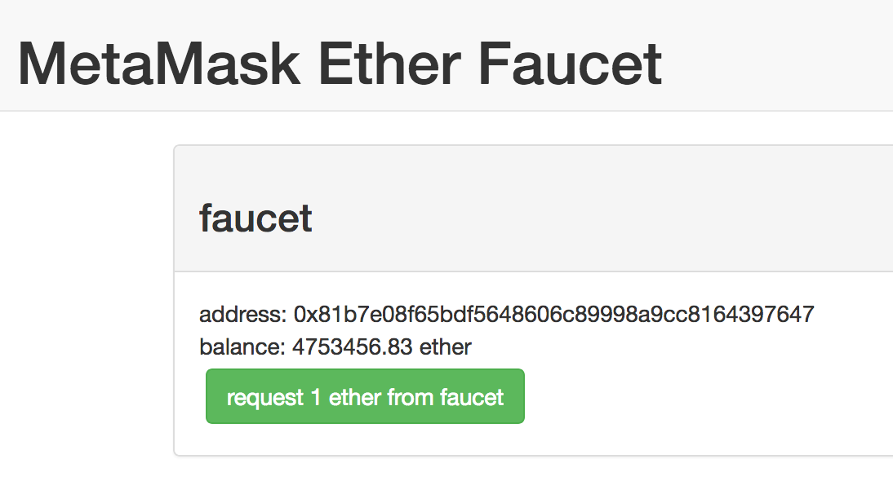
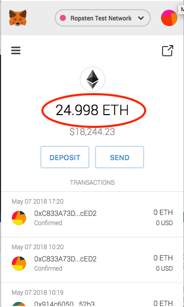
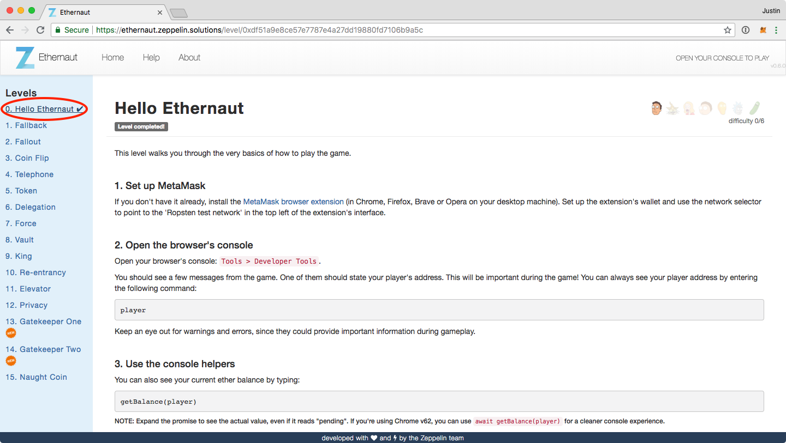
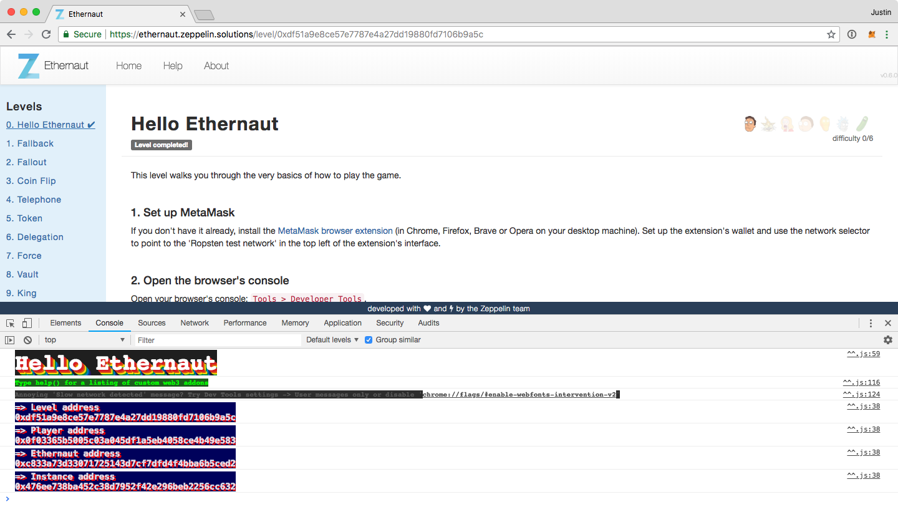
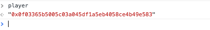
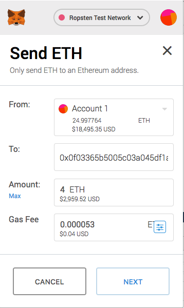
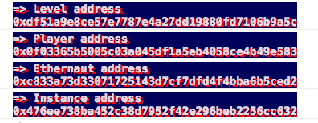
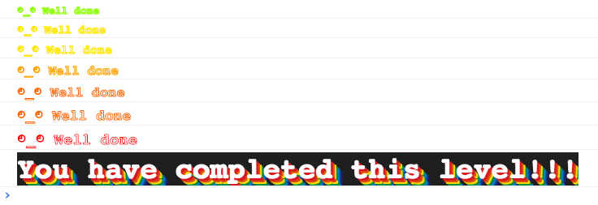

# ethernaut ctf / pittsburgh steel city infosec
We are going to be going through the enternaut cfp from Zeppelin.

https://ethernaut.zeppelin.solutions/

This cfp uses the browser’s debug console to execute command on the test ethereum network.

# Prerequisites
## Installing Metamask

First off, we need to install the Metamask extension. This will allow us to transfer funds and pay for gas on the Ethereum test network.

https://metamask.io/

Keep in mind that I’ve had issues with some browsers - the one I would recommend would be Chrome.

Once you install Metamask, create a vault, and switch to the **Ropsten Test Network**.

Now you need some test ether. Go to the following site to get some test ether.

https://faucet.metamask.io/

Now click on the request 1 button a few times. Probably best to get around 10 ether (but don't go too crazy, lest you get the dreaded `{"error":"User is greedy."}` error). It will take up to a minute to process, as this is waiting to mine the next block on the test network.

Once the transaction have successfully mined, you will be able to see a positive number in your Metamask extension.

Great - now we can start on the challenges. Go to the CTF website and click on the **Hello Ethernaut** level:

https://ethernaut.zeppelin.solutions/

As mentioned before, this exercise will interact with the browser’s console (Web3, Promise, etc.). The commands you type in will execute and interact with the current Instance / Contract.

So let’s try a few commands. First open up your Console debug tool in Chrome.

Now type `player` in the console line. It should return the address associated with the player (you).

> If you get an `Uncaught ReferenceError: player is not defined` error, you should be able to fix it by reopening the ethernaut.zeppelin.solutions page.  This will happen if you are playing around on the ethernaut page prior to installing MetaMask.

Now let’s try and generate an Instance. Scroll to the bottom of the page and click on the button `Get new instance`.

> Note: if you generate a TypeError from generating a new instance, then I would recommend trying to send yourself 4 ETH via Metamask. Click the Metamask extension, click on the ***Send*** button, and then fill in the information to send. The To: address should be yours (should be available in the dropdown) and the amount should be 4 ETH. Then click `Next` and `Confirm` the transaction. It will take a couple of moments to mine. Once you see the transaction went through, try and clicking on the* ***Get new instance*** *button again.*

If you are successfully setup for the CTF, reload the page and you should see four addresses listed within the console - level, player, ethernaut, and instance.

Congrats - you are now setup to play on the CTF. Walk through the intro **Hello Ethernaut** before coming to the event would be helpful. You can start by typing:

`contract.info()`

Follow the guidance through the console to complete the level. Once you are successful, click on the `Submit instance` button to validate if all checks have been cleared. If you are completed and the transaction has been mined, you will see this message.

# Command References

**player:** returns the address of the player

**getBalance(player):** returns the about of ether held by player.

**await:** built in command for dealing with asynchronous command (Promise)
     (i.e. **await getBalance(player)** )

**contract.abi:** returns all publicly available methods for the contract.
